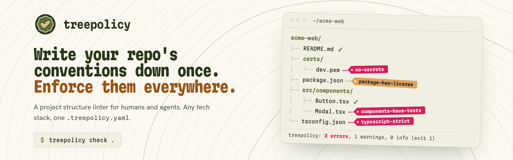

<picture>
  <source media="(prefers-color-scheme: dark)" srcset="github-banner-dark.png">
  
</picture>

**treepolicy** is a project structure linter for humans and agents.

Write your repository's conventions down once — which files must exist, how things are named,
what config files must contain — and enforce them everywhere: in CI, in your editor, and in the
AI agents working on your code.

```bash
go install github.com/janbiasi/treepolicy/cmd/treepolicy@latest
treepolicy check .
```

## Projects

- [**treepolicy**](https://github.com/janbiasi/treepolicy) — the CLI, LSP and MCP server
- [**treepolicy-action**](https://github.com/treepolicy/treepolicy-action) — run treepolicy in GitHub Actions
- [**treepolicy-vscode-extension**](https://github.com/treepolicy/treepolicy-vscode-extension) — integration for VSCode
- [**homebrew-tap**](https://github.com/treepolicy/homebrew-tap) — package declaration for homebrew
- [**nur**](https://github.com/treepolicy/nur) — flakes declaration for nix

## Learn more

Read the docs at [docs.treepolicy.org](https://docs.treepolicy.org).
